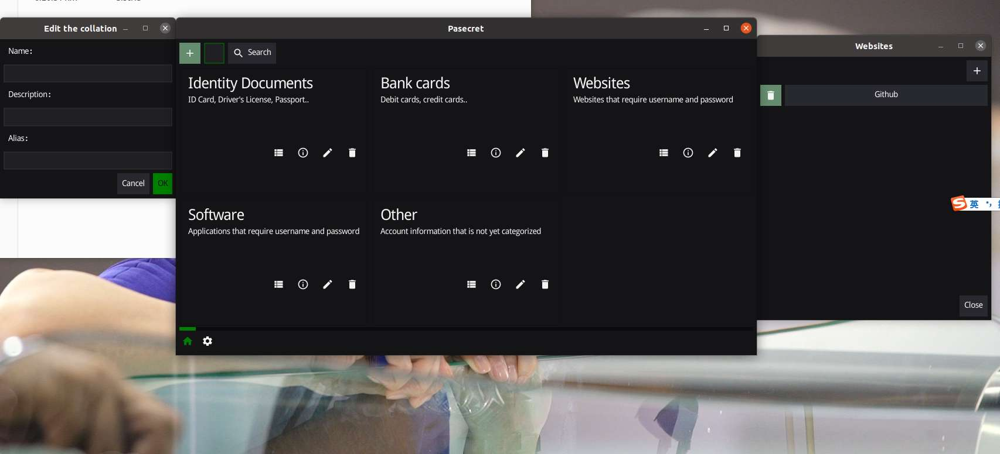
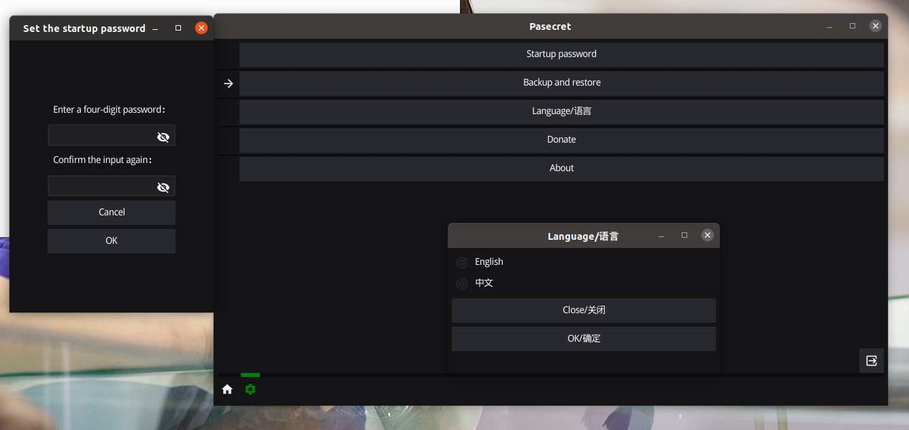
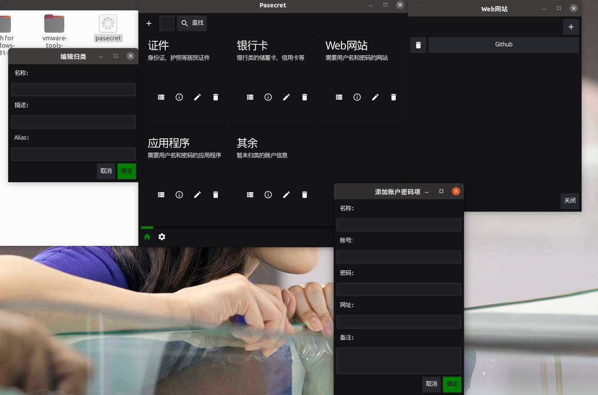
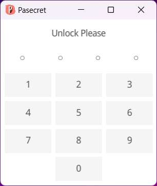
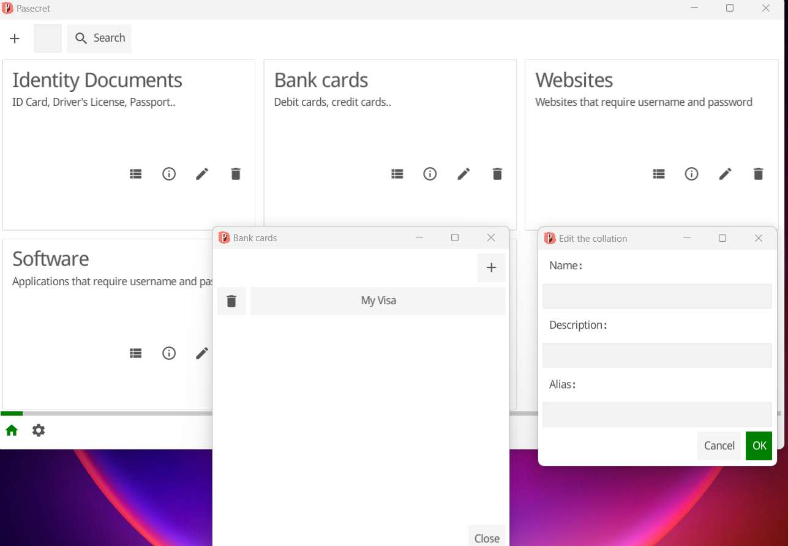
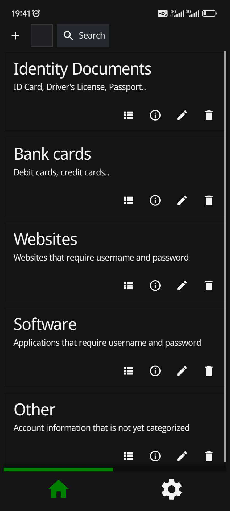
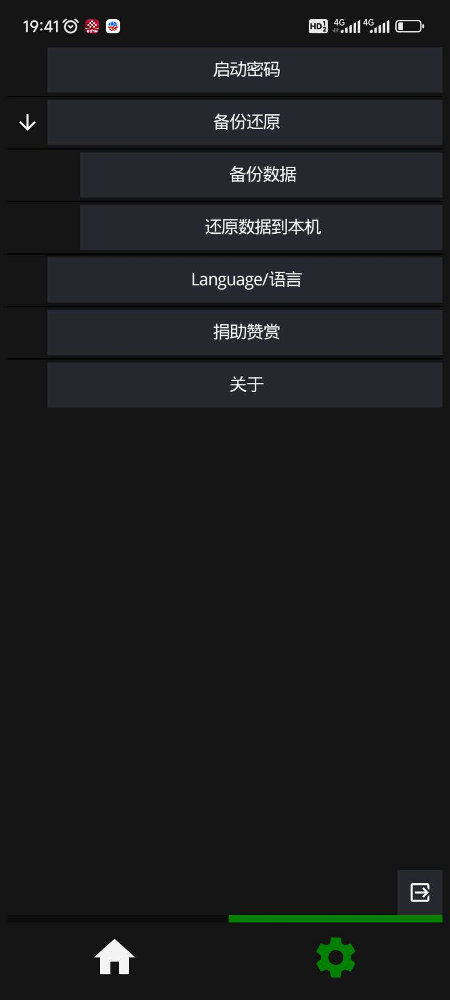
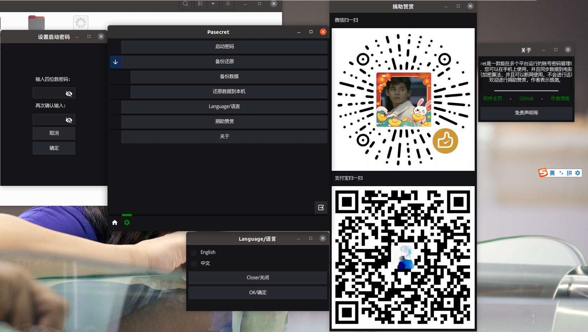

## Pasecret is an account password manager that can run on multiple platforms.
### It uses the Go language, is based on <a link='https://fyne.io/'>fyne</a>, and currently runs on Windows, Android, Linux (Ubuntu).
###### Similarly, it can run on macOS and IOS, but I haven't tested them.

You can use it on your mobile device and sync your data to your computer and vice versa. Support backing up data and keeping passwords forever.
The data is encrypted and can be used without any remote transmission.  Pasecret supports startup passwords and provides Chinese and English localization support. 

## Pasecret是一款能在多个平台运行的账号密码管理软件。
### 它使用Go语言，基于<a link='https://fyne.io/'>fyne</a>框架，目前可以在Windows、Android、Linux(Ubuntu)上运行。
###### 同样的，它也可以运行在macOS、IOS上，但我没有对其进行过测试。

您可以在移动设备上使用，并且同步数据到电脑端，反之亦然。支持备份数据，密码永存。
数据采用加密算法，并且可以断网使用，不会进行任何远程传输。 
Pasecret支持设置启动开锁密码，并且提供了中文和英文本地化支持。

